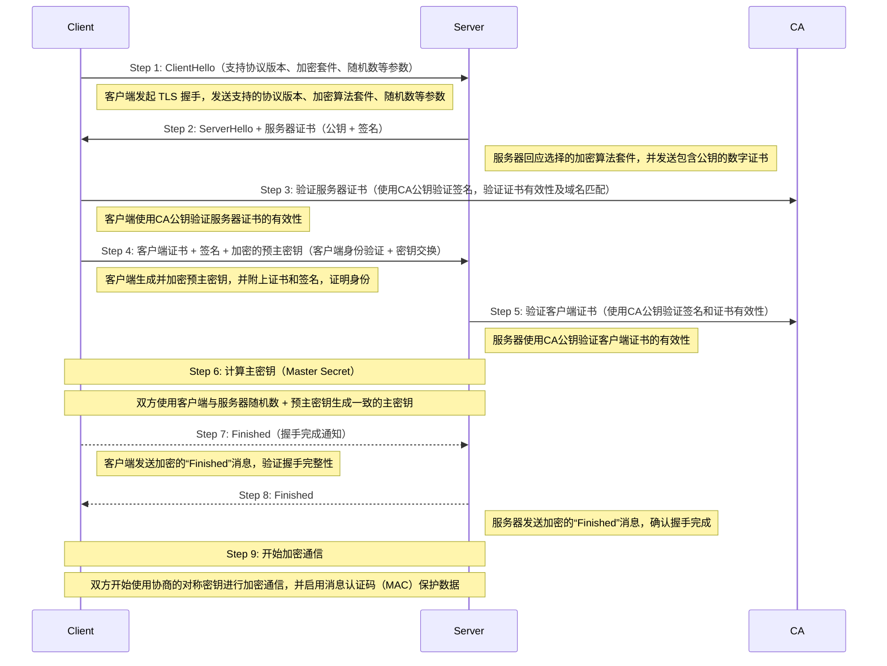

[TOC]

# 链接
1. https://maokun.blog.csdn.net/article/details/80631369?fromshare=blogdetail&sharetype=blogdetail&sharerId=80631369&sharerefer=PC&sharesource=IMPlove&sharefrom=from_link
2. https://www.cnblogs.com/lixianguo/p/12522557.html
3. https://www.cnblogs.com/yelao/p/9486882.html

# SSL 和 TLS 协议
## 概念
1. 消息认证： SSL 2.0 使用较弱的 MAC 构造，而 SSL 3.0 及以上版本和 TLS 都使用 HMAC（基于密钥的哈希消息认证码）。
2. 证书要求：两者都需要证书。两者在服务器身份验证中都依赖证书，客户端可选择信任.
3. 关系：TLS 证书是一种新的协议，这种协议是建立在 SSL3.0 协议规范之上，是 SSL3.0 的后续版本。

## SSL/TLS 双向认证流程



### 认证方式差异
| 认证类型 | 客户端验证 | 服务器验证 | 典型应用场景 |
|---------|-----------|-----------|-------------|
| 单向认证 | 不需要    | 必须      | 普通HTTPS   |
| 双向认证 | 必须      | 必须      | 金融系统/企业VPN |

# 自签名证书的生成与使用

## 术语
- 后缀
  1. .key格式文件：私有的密钥。
  2. .csr格式文件：证书签名请求（证书请求文件），含有公钥信息。certificate signing request的缩写。
  3. .crt格式文件：证书文件。certificate的缩写。
  4. .crl格式文件：证书吊销列表。Certificate Revocation List的缩写。
  5. .pem格式文件：用于导出导入的证书格式，带开头结尾标记。

- Subject Alternative Name（简称 SAN）是 SSL/TLS 证书中的一个扩展字段，用来指定证书支持的多个域名或 IP 地址。它是现代 HTTPS 证书中的一个关键组成部分，比老式的 Common Name (CN) 更灵活、更安全。

## 生成自签名证书
```bash
#!/bin/bash
# function: 创建 nginx https ,双向认证证书
#
# BEGIN

# 修改为你自己的域名
domain="me-api-stg.garys.top"

# ---------- CA ----------
echo "创建 CA 私钥..."
openssl genrsa -out $domain.CA.key 2048

echo "根据私钥创建 CA 证书请求..."
openssl req -new -key $domain.CA.key -out $domain.CA.csr -subj /C=CN/ST=GuangDong/L=GuangZhou/O=${domain}/OU=${domain}/CN=opcenter/emailAddress=${domain} -utf8

# 签发 CA 证书请求
# 使用自己的私钥来给这个CA证书请求签名
# 经过多次测试得知: 这个时间如何设置的太长,如 3650(10年) ,chrome浏览器会报, 该网站使用的安全设置已过期,所以https不会显示是绿色, 而是带一个黄色三角形的图标。
# 奇怪的是: 如果设成1年,也就是365天,不会提示该网站使用的安全设置已过期,而且也是绿色的标识。但如果是2年, 也是绿色的标识,但是会提示该网站使用的安全设置已过期，这个应该chrome浏览器的问题。
echo "签发 CA 证书..."
openssl x509 -req -in $domain.CA.csr -signkey $domain.CA.key -out $domain.CA.crt -days 365

 
# CA证书转换为DER格式,DER格式似乎更加通用
openssl x509 -in $domain.CA.crt -out $domain.CA.der -outform DER
# 现在, 终于拿到了自己做 CA 需要的几个文件了, 
# 密钥: $domain.CA.key
# 证书: $domain.CA.crt
# 系统使用的: $domain.CA.der
# 接下来, 要创建一个网站, 就需要让 CA 给他签名一个证书了
 

# --------- SERVER ----------
echo "创建服务端私钥..."
openssl genrsa -out $domain.server.key 2048

# 生成网站证书请求。CN 一定要是网站的域名, 否则会通不过安全验证
echo "创建服务端证书请求..."
openssl req -new -key $domain.server.key -out $domain.server.csr -subj /C=CN/ST=GuangDong/L=GuangZhou/O=${domain}/OU=${domain}/CN=$domain/emailAddress=${domain} -utf8

# 创建包含 SAN 的扩展文件
echo "subjectAltName = DNS:$domain, DNS:www.$domain, IP:$IP" > san.ext

# CA签名网站证书请求
# 不是拿到 CA 的证书了就可以说自己是 CA 的, 最重要的是, 签名需要有 CA 密钥
# 如果客户端（个人浏览器）信任 CA 的证书的话, 那么他也就会信任由 CA 签名的网站证书
# 因此让浏览器信任 CA 的证书之后, 客户端就自然信任服务端了, 只要做单向认证的话, 到这一步证书这一类材料就已经准备好了
# 但是双向认证就还要给客户端（个人的浏览器）准备一份证书
# 让服务端可以知道客户端也是合法的。
# 假如让服务端也信任 CA 的证书
# 那 CA 签名的客户端证书也就能被信任了。
echo "使用 CA 签发服务端证书（包含 SAN）..."
openssl x509 -req -in $domain.server.csr -out $domain.server.crt -CA $domain.CA.crt -CAkey $domain.CA.key -CAcreateserial -days 365 -extfile san.ext
   

# --------- CLIENT ----------
echo "创建客户端私钥..."
openssl genrsa -out $domain.client.key 2048

echo "创建客户端证书请求..."
openssl req -new -key $domain.client.key -out $domain.client.csr -subj /C=CN/ST=GuangDong/L=GuangZhou/O=${domain}/OU=${domain}/CN=$domain/emailAddress=${domain} -utf8

echo "使用 CA 签发客户端证书（包含 SAN）..."
openssl x509 -req -in $domain.client.csr -out $domain.client.crt -CA $domain.CA.crt -CAkey $domain.CA.key -CAcreateserial -days 365 -extfile san.ext

echo "客户端证书转换为 DER 格式..."
openssl x509 -in $domain.client.crt -out $domain.client.der -outform DER

# 客户端证书转换为 PKCS, 即 p12格式, 通常以 p12 作为后缀。全称叫做 Personal Information Exchange
echo "客户端证书转换为 p12 格式..."
openssl pkcs12 -export -in $domain.client.crt -inkey $domain.client.key -out $domain.client.p12 -password pass:123456

# 将客户端的 .p12 证书包转换成一个 PEM 格式的文件。
openssl pkcs12 -in $domain.client.p12 -out all.pem -nodes 
# -nodes 表示不加密私钥
```

## 生成自签名证书/简单版
```sh
# 1. 创建 OpenSSL SAN 配置文件
cat > san.cnf <<EOF
[req]
distinguished_name = req_distinguished_name
x509_extensions = v3_req
prompt = no

[req_distinguished_name]
CN = 自己的域名

[v3_req]
subjectAltName = @alt_names

[alt_names]
DNS.1 = 自己的域名
DNS.2 = www.自己的域名
IP.1 = 自己的IP
EOF

openssl req -x509 -nodes -days 365 -newkey rsa:2048 -keyout /usr/local/nginx/ssl/nginx.key -out /usr/local/nginx/ssl/nginx.crt -config san.cnf -extensions v3_req
# req 表示想使用 X.509 certificate signing request (CSR) 进行管理
# -x509 表示使用自签名证书代替在线 CSR 请求。
```

## 双向认证校验
```bash
curl  -k --cert ./$domain.client.crt --key ./$domain.client.key https://$domain
curl  -k --key ./all.pem https://$domain
```

## 自签名证书和权威机证书
### 防止信息被第三方窃听或篡改解决方案
1. **对称加密**  
   - 原理：客户端与服务端使用同一个密钥加解密数据。  
   - 缺点：密钥在传输过程中容易被中间人截获，安全性差。  
   - 特点：
     - 加密解密速度快  
     - 密文大小 ≈ 明文大小  
     - 双方信息都加密传输

2. **非对称加密**  
   - 原理：服务端提供公钥，客户端用公钥加密数据发给服务端，服务端用私钥解密。  
   - 缺点：
     - 只有客户端的数据被加密  
     - 公钥易被中间人篡改（中间人攻击）  
     - 加密慢，且长度受限  
   - 特点：
     - 密文 > 明文  
     - 加解密速度慢

3. **混合加密（实际 HTTPS 使用方式）**  
   - 步骤：
     1. 客户端通过服务端的公钥，加密生成一个临时对称密钥
     2. 用该密钥进行后续通信加密（对称加密）
   - 优点：结合非对称加密的安全性 + 对称加密的效率
   - 仍存在风险：**第一次公钥传输可能被中间人截获并替换**


### 公钥被中间人篡改解决方案
#### ➤ 方案一：浏览器预存所有服务端的公钥  
- 不现实。因为全球服务器太多，浏览器无法维护所有公钥列表。

#### ➤ 方案二：引入**权威机构（CA）颁发证书**（HTTPS 标准做法）  
1. 服务端向可信 CA（如 DigiCert、Let's Encrypt）申请证书  
2. CA 使用私钥对服务器信息和公钥进行签名，生成证书  
3. 浏览器内置多个 CA 的**公钥**  
4. 校验证书流程如下：
   - 浏览器用 CA 的公钥解密证书签名
   - 使用相同算法对证书内容做哈希
   - 两者一致，说明证书可信
   - 获取服务端真实公钥，用于加密临时密钥

### 自签名证书 vs 权威机构证书（CA）

| 对比项       | 自签名证书（Self-Signed）             | CA 颁发证书（Authority Issued）            |
|--------------|----------------------------------------|---------------------------------------------|
| 信任机制     | 自己签自己，浏览器默认不信任           | 由受信任的 CA 签发，浏览器自动信任         |
| 证书验证     | 客户端需手动导入 CA 根证书              | 浏览器通过内置 CA 公钥自动验证             |
| 成本         | 免费                                     | 免费（如 Let’s Encrypt）或付费（如 DigiCert）|
| 使用场景     | 内网测试、开发、企业内部服务            | 生产环境，面向公网的服务                   |
| 安全风险     | 易被中间人冒充                           | 基本防中间人攻击（前提：CA 不被攻破）     |
| 浏览器警告   | 🚫“连接不安全”提示                     | ✅ 显示绿色锁或公司名（EV 证书）           |
